🛡️ Secure AI Customer Assistance 

A production-grade **AI-powered customer support chatbot** built with **LangChain**, **LangGraph**, **GPT-4**, and **RAG**, featuring intelligent **prompt routing**, a **multi-layer security system**, and real-time **monitoring via Splunk**. User queries are classified by an LLM-powered router node and dispatched to one of three specialized handler nodes, each with its **own dedicated RAG pipeline**

## 🚀 Overview

This project demonstrates how to build and **safely deploy** a real-world LLM application — combining advanced AI capabilities with enterprise-grade security and observability. User queries are classified by an LLM-powered **router node** and dispatched to one of three **specialized handler nodes**, each backed by its own **isolated RAG pipeline** grounded in domain-specific knowledge. Every request — whether blocked or processed — is fully logged to Splunk with structured metadata and latency metrics.

## ✨ Features

- 🔀 **Intelligent prompt routing** — LangGraph classifies each query and dispatches to the correct domain node automatically
- 🛡️ **Three-layer security guardrail** — regex, vector similarity, and LLM-based injection detection running in sequence on every input
- 📚 **Isolated RAG pipelines** — separate Chroma vector stores per domain prevent cross-domain retrieval noise
- 📊 **Full Splunk observability** — every pipeline stage logged with structured fields and latency metrics
- ⚡ **End-to-end latency tracking** — retrieval time, LLM response time, routing time, and total processing time captured per request
- 🧪 **Adversarial test suite** — `test_cases.py` covers direct injection, obfuscated attacks, jailbreaks, and benign edge cases
- 🖥️ **Gradio UI** — clean chat interface with optional public shareable link

## Architecture


## 🧠 Tech Stack

| Layer | Technology |
|---|---|
| LLM | OpenAI GPT-4 |
| Agent Framework | LangChain + LangGraph |
| Retrieval (RAG) | LangChain + PyPDFLoader + OpenAI Embeddings + Chroma |
| Prompt Engineering | SystemMessage + HumanMessage |
| Prompt Optimization | LLMLingua Prompt compressor |
| Prompt Routing | LangGraph conditional edges / node routing |
| Security — Rule-based | Regex pattern matching |
| Security — Semantic | Chroma vector similarity (cosine) |
| Security — LLM | GPT-4 binary classifier with reasoning trace |
| Monitoring | Splunk HEC (HTTP Event Collector) |
| UI | Gradio |

---

**Node responsibilities:**

| Node | Handles | RAG Knowledge Base |
|---|---|---|
| `router` | Classifies incoming query intent via `llm_call_router()` | — |
| `router` | Classifies incoming query and despatch to correspondent Node.  
| `product` | Product questions — features, recommendations, availability | Product catalog & docs |
| `billing` | Billing questions — payments, invoices, subscriptions, refunds | Billing records & policies |
| `technical` | Technical support — troubleshooting, errors, configuration | Technical docs & FAQs |

Each node retrieves from its **own isolated vector store** to ensure responses are grounded in the most relevant domain-specific knowledge without cross-domain noise, allows each store to be updated independently, and enables domain-specific chunking strategies per node.

---

## 📊 Monitoring & Observability (Splunk)

All events are logged to Splunk in real time — covering **security violations**, **allowed requests**, **routing decisions**, and **chatbot responses**, giving complete visibility at every stage of the pipeline.
All events are logged to Splunk in real time covering **security violations**, **allowed requests**, **routing decisions**, and **chatbot responses**, giving complete visibility at every stage of the pipeline.

---

## ⚙️ Installation

### 1. Clone the repo

```bash
git clone https://github.com/your-username/secure-ai-chatbot.git
cd secure-ai-chatbot
```

### 2. Create a virtual environment

```bash
python -m venv venv
source venv/bin/activate      # Mac / Linux
venv\Scripts\activate         # Windows
```

### 3. Install dependencies

```bash
pip install -r requirements.txt
```

---

## ▶️ Usage

### Start the chatbot

```bash
python Gradio.py
```

Gradio launches a local interface at `http://localhost:7860`. To generate a public shareable link, set `share=True` in the `launch()` call inside `Gradio.py`:

```python
demo.launch(share=True)
```

### Run the security test suite

```bash
python test_cases.py
```

Runs all adversarial test cases against the three guardrail layers and prints detection coverage results.

---

## 🗂️ Project Structure

```
productChatBot/
│
├── Gradio.py           # Main chatbot + Gradio interface
├── guardrail.py        # Prompt injection detection (all 3 layers)
├── state.py            # Shared LangGraph state object
├── vector_db.py        # Embeddings + Chroma vector stores + similarity search
├── Splunk_logger.py    # Splunk HEC logging integration
├── test_cases.py       # Adversarial security test suite
├── requirements.txt    # Python dependencies
├── .env                # Environment variables (not committed)
└── README.md
```

